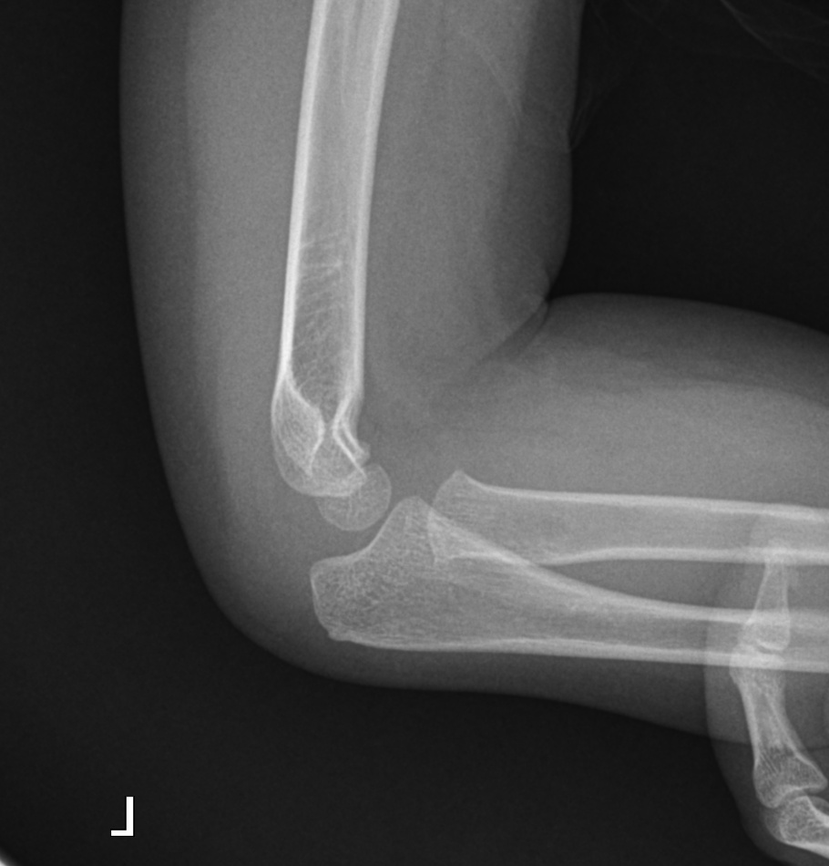
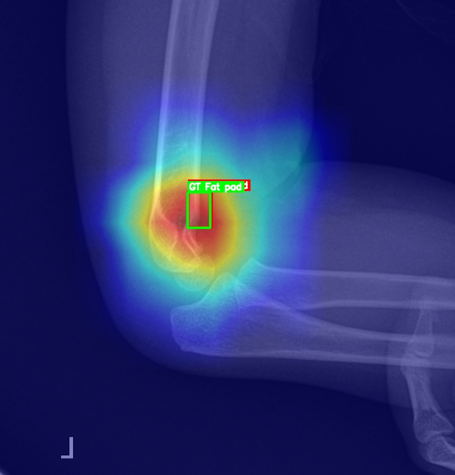
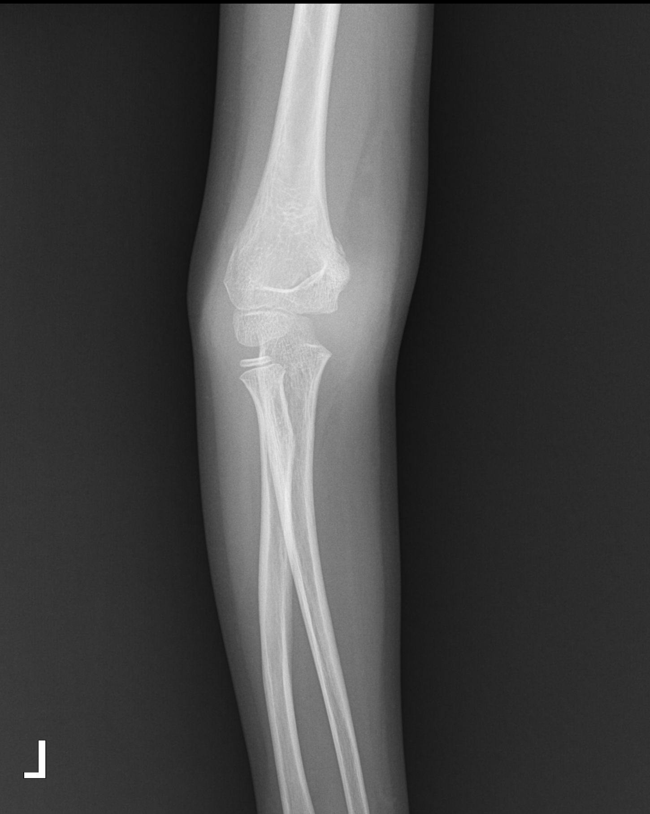
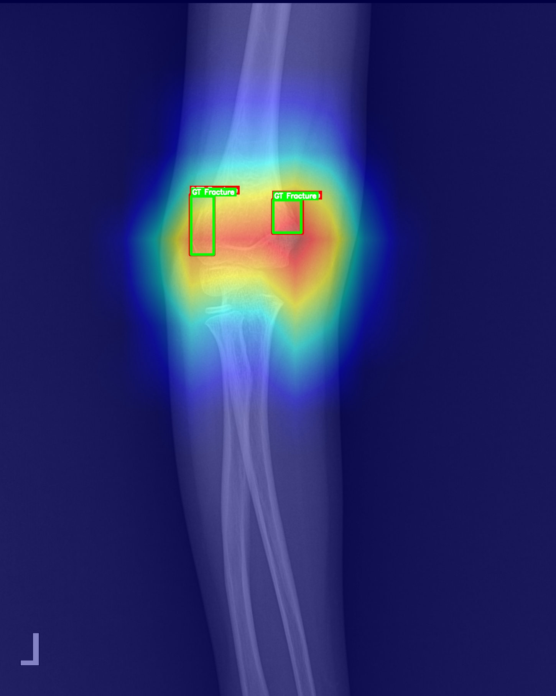
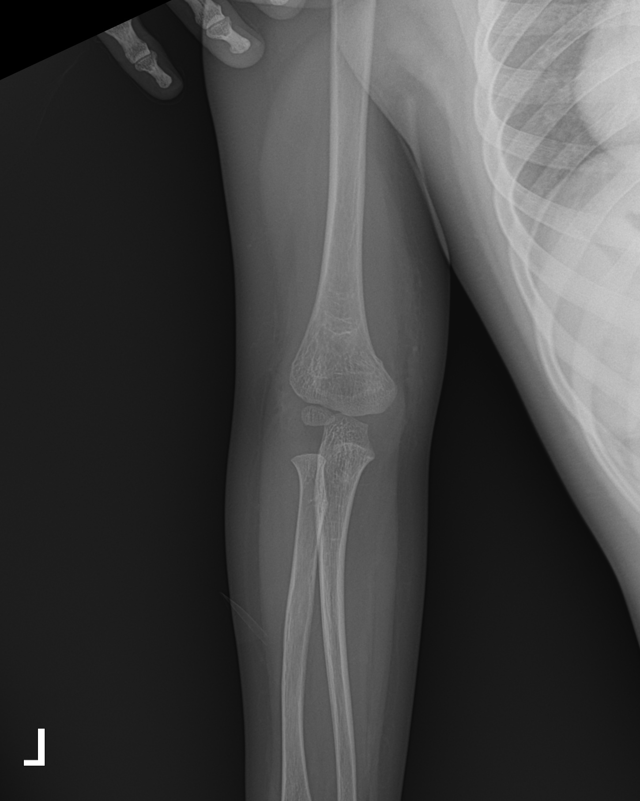
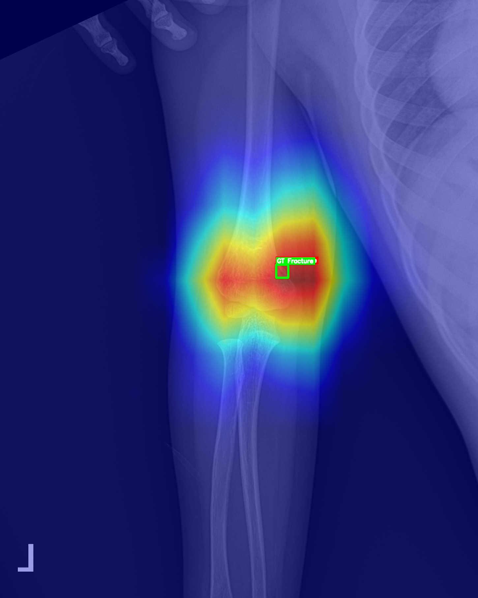
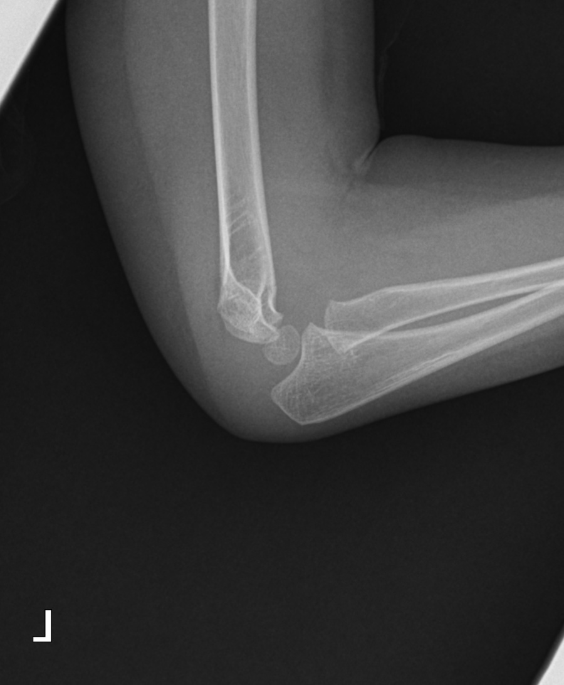
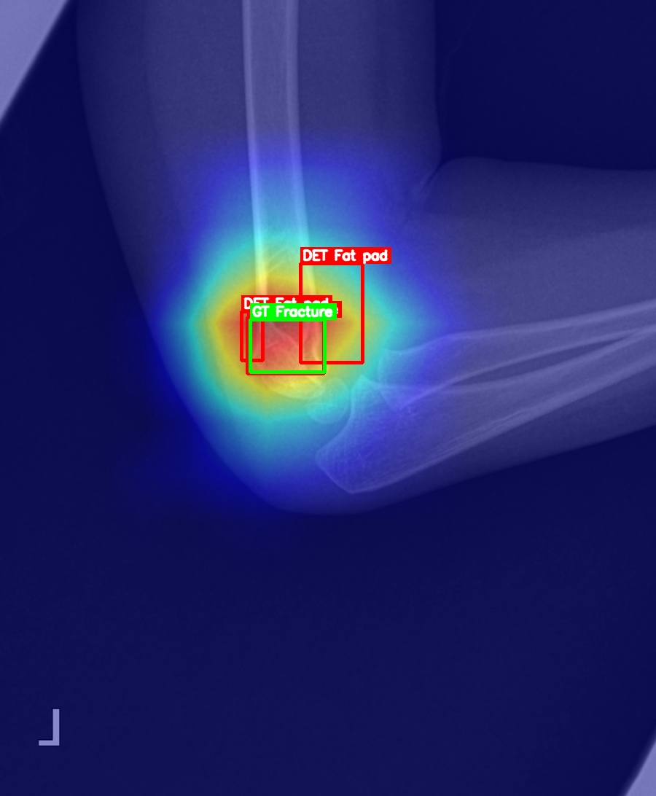

# Pediatric Wrist & Elbow Fracture AI Pipeline

소아 손목/팔꿈치 X-ray 영상에서 **골절 및 fat pad sign 검출**을 지원하는 AI 파이프라인.  
YOLOv9 기반 **Detection**, Swin Transformer  / ConvNeXt_v2 기반 **Classification**, 그리고 **Ensemble** 전략으로 성능을 향상. Grad-CAM 기반 시각화 지원.

---

## 📦 Features
- **Detection**: YOLOv9 (Fracture, Fat pad)
- **Classification**: ConvNeXt_v2 , Swin Transformer (ROI별 binary classification)
- **Ensemble**: Cls × 0.6 + Det × 0.4
- **Explainability**: Grad-CAM, BBOX result overlays
- **MLOps**: MLflow 기반 로그 관리, reproducibility , RAY 하이퍼파라미터 활용

---

## 📂 Project Structure
```
Ensemble_Model/
├─ classification/    # SwinT 학습 및 테스트
├─ detection/         # YOLOv9 학습 및 테스트
├─ Ensemble/          # Ensemble inference (AP/LAT, fracture + fat pad)
│  ├─ Result/         # inference output (images, CAM)
│  └─ Final_inference_APLAT_ensemble_from_uploaded_paths_0820.py
├─ Cropping/          # ROI crop logic
├─ Labeling/          # labeling utils
├─ PediatricFracture_Wrist/ # dataset scripts
├─ setup_pediatric_wrist_oneclick.py
├─ requirements.txt
└─ README.md
```

---

## ⚙️ Installation
```bash
conda create -n Ensemble_Model python=3.10 -y
conda activate Ensemble_Model
pip install -r requirements.txt
```

---

## 🚀 Usage

### 원클릭 실행
```bash
python setup_pediatric_wrist_oneclick.py
```

### 개별 학습
```bash
# Classification
python classification/train_swinT_parts_final.py --config config.yaml

# Detection
python detection/train_crop.py --cfg models/yolov9-c.yaml --data data/wrist.yaml
```

### Ensemble Inference
```bash
python Ensemble/Final_inference_APLAT_ensemble_from_uploaded_paths_0820.py
```

---

## 📊 Results (Ensemble)

- **Ensemble 계산식:** `Final = Cls*0.6 + Det*0.4`  
- **Threshold:**  
  - ~10/16 → Fixed threshold = `0.25`  
  - 10/28 이후 → **Youden threshold (최적 감도·특이도 기준)**  
- **95% CI:** DeLong method 기반 (신뢰구간 95%)

| Date | Task | View | Samples (pos / neg) | Sensitivity (95% CI) | AUROC (95% CI) | Notes |
|---|---|---|---|---:|---:|---|
| 2025-09-02 | FX | AP  | 311 (217 / 94) | **0.9333 (0.90–0.96)** | **0.9789 (0.96–0.99)** | Miss 6, Over 2 |
| 2025-09-02 | FX | LAT | 320 (219 / 101) | **0.9149 (0.88–0.95)** | **0.9783 (0.96–0.99)** | Miss 8, Over 3 |
| 2025-09-04 | FX+Fat Pad | AP  | 311 (217 / 94) | **0.9255 (0.89–0.95)** | — | Miss 7, Over 16 |
| 2025-09-04 | FX+Fat Pad | LAT | 320 (219 / 101) | **0.9307 (0.90–0.96)** | — | Miss 8, Over 3 |
| 2025-10-14 | FX+Fat Pad | AP  | 311 (217 / 94) | **0.9451 (0.91–0.97)** | **0.9680 (0.94–0.99)** | Miss 5, Over 56 , Best Sensitivity |
| 2025-10-14 | FX+Fat Pad | LAT | 320 (219 / 101) | **0.9216 (0.89–0.95)** | **0.9510 (0.93–0.97)** | Miss 7, Over 56 , Best Sensitivity |
| 2025-10-16 | FX+Fat Pad | AP  | 311 (217 / 94) | **0.9341 (0.90–0.96)** | **0.9711 (0.95–0.99)** | Miss 5, Over 26 , Best F1 |
| 2025-10-16 | FX+Fat Pad | LAT | 320 (219 / 101) | **0.9216 (0.89–0.95)** | **0.9610 (0.94–0.98)** | Miss 8, Over 10 , Best F1 |
| 2025-10-28 | FX+Fat Pad | AP  | 311 (217 / 94) | **0.938 (0.90–0.97)** | **0.9629 (0.94–0.98)** | Miss 6, Over 15 , Youden threshold |
| 2025-10-28 | FX+Fat Pad | LAT | 320 (219 / 101) | **0.931 (0.89–0.96)** | **0.9628 (0.94–0.98)** | Miss 8, Over 17 , Youden threshold |
| 2025-10-28 | FX+Fat Pad (Patient Ensemble) | AP + LAT | 304 (patients) | **0.917 (0.87–0.95)** | **0.9469 (0.92–0.97)** | OR logic , Youden threshold |

---

## 🖼️ Example Visualizations

원본 X-ray vs Grad-CAM + BBOX Overlay (Detection + Classification Ensemble).  
**모든 이미지는 비식별화된 샘플 데이터.**

| Original | Grad-CAM |
|---|---|
|  |  |
|  |  |
|  |  |
|  |  |

---

## 🤝 Acknowledgements
- **Crescom AI** 연구원 김진규
- **Seoul Asan Medical Center** Pediatric Emergency/Trauma Team  
- **MURA**, **GRAZPEDWRI-DX** dataset  
- **Ultralytics YOLO**, **timm (Swin Transformer)**, **ConvNeXt_v2**
- **MLflow**, **PyTorch**, **OpenMMLab**
